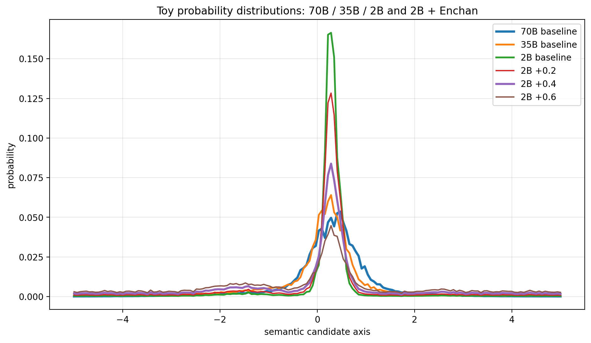

# Enchan CLI

Enchan CLI is a local terminal chat interface for Enchan-backed and Ollama-backed GGUF runtimes.

This repository contains the CLI source and installer scripts. Native runtime binaries are distributed from this repository's GitHub Release and installed into `backend/bin/<platform>/`.

## Prerequisites

Required commands:

- Git: `git`
- Node.js/npm: `node`, `npm`
- Python: `python` on Windows or `python3` on macOS, or set `ENCHAN_PYTHON`
- macOS: `curl`, `unzip`, and Xcode Command Line Tools for runtime library inspection

## One-Command Install

### Windows PowerShell

```powershell
powershell -ExecutionPolicy Bypass -c "irm https://github.com/EnchanTheory/Enchan-CLI/raw/main/bootstrap/install.ps1 | iex"
```

### Apple Silicon macOS

```bash
curl -fsSL https://github.com/EnchanTheory/Enchan-CLI/raw/main/bootstrap/install.sh | sh
```

The bootstrap installer clones or updates Enchan CLI in `~/.enchan` and then runs the platform installer from that checkout.

## Manual Checkout Install

### Windows PowerShell

```powershell
git clone https://github.com/EnchanTheory/Enchan-CLI.git "$env:USERPROFILE\.enchan"
cd "$env:USERPROFILE\.enchan"
.\install.ps1
```

### Apple Silicon macOS

```bash
git clone https://github.com/EnchanTheory/Enchan-CLI.git ~/.enchan
cd ~/.enchan
chmod +x ./install.sh
./install.sh
```

The installer downloads the Enchan CLI runtime from this repository's release `llamacpp-b9840-enchan-20260703`, extracts it into `backend/bin/<platform>/`, installs Python UI dependencies into a local `.venv`, and registers the `enchan` command with `npm link`.

## Update

After installation, update the checkout and refresh the linked command with:

```bash
enchan update
```

This runs `git pull --ff-only` in the install directory. When new commits are applied, Enchan refreshes the installer-managed assets; when the checkout is already current, it exits without reinstalling. Normal `enchan` startup checks for updates in the background and prints a short notice when a newer commit is available.

To force a local asset repair without waiting for source changes, run `enchan update --repair`.

The installer keeps Python dependencies in a local `.venv`, recreates that environment when `requirements.txt` changes, and tracks native runtime files with a manifest so obsolete runtime files can be pruned when the runtime asset changes.

If the installed command is older and does not yet support `enchan update`, update once manually from the install directory:

```powershell
cd "$env:USERPROFILE\.enchan"
git pull --ff-only
.\install.ps1
```

```bash
cd ~/.enchan
git pull --ff-only
./install.sh
```

## Runtime Assets

Runtime assets are published in the Enchan CLI release:

- Repo: `EnchanTheory/Enchan-CLI`
- Tag: `llamacpp-b9840-enchan-20260703`
- Windows asset: `enchan-cli-runtime-win-x64.zip`
- macOS asset: `enchan-cli-runtime-macos-arm64.zip`

Expected runtime layout after install:

```text
backend/bin/win-x64/llama-server.exe
backend/bin/win-x64/enchan.dll
backend/bin/macos-arm64/llama-server
backend/bin/macos-arm64/libenchan.dylib
```

## Usage

Start the interactive CLI:

```bash
enchan
```

Select a backend at startup:

```bash
enchan
```

One-shot mode:

```bash
enchan --ask "Summarize this repository" --plain
```

Run Enchan backend with an explicit KV cache dtype:

```bash
enchan --backend enchan --kv-cache-type q4_0
```

`--kv-cache-type` controls llama.cpp KV cache quantization for the Enchan backend. The default is `q4_0`, which minimizes memory use for large models and long contexts on edge devices. Use `q8_0` or `f16` when you prefer higher KV precision over lower RAM usage.

Supported values:

- `q4_0`: default; smallest KV cache footprint
- `q8_0`: larger cache, higher precision
- `f16`: default llama.cpp-style precision, highest KV memory use

## Enchan Engine (Attention Screening)

While Enchan CLI utilizes llama.cpp as its base runtime, it integrates a proprietary **Enchan Cosmic Engine** directly into the core Attention calculations. This mechanism is based on the **working hypothesis** that mathematically relaxing the over-concentration of Attention scores can mitigate the model fixating too rigidly on a single context path.

To customize the screening strength from the command line (e.g., setting it to `0.4`):

```bash
enchan --screen-strength 0.4
```

### Representative Attention Distribution

The engine applies a non-linear tension response to the raw Attention logits before the Softmax operation. In the simplified example below, `S` denotes the screening strength.

| Context Token | Raw Logit | S=0.0 (Standard) | S=0.2 (Moderate) | S=1.0 (Extreme) |
| :--- | :--- | :--- | :--- | :--- |
| `To` | 5.8 | 6.53% | 8.98% | 24.19% |
| `be` | **8.2** | **84.23%** | **78.70%** | 45.17% |
| `or` | 2.7 | 0.25% | 0.45% | 3.51% |
| `not` | 6.1 | 8.98% | 11.86% | 27.13% |

*The table above is an illustrative, simplified view of how the screening changes attention-score concentration before Softmax. It is not intended to expose the exact proprietary kernel or reproduce the full end-to-end vocabulary distribution.*

At `S=0.2`, the dominant logit (`8.2`) is selectively suppressed. The Softmax weight of `be` drops from `84.23%` to `78.70%`, gently redistributing probability mass to the surrounding context without breaking the monotonic ranking.

### Toy View: Attention Peak Relaxation

The following toy model illustrates the intuition behind Enchan Screening.

A small model can form a sharp probability peak over a small number of semantic candidates. Enchan Screening relaxes that peak so the distribution becomes less rigid and neighboring candidates can surface.



This is not a claim that a small model becomes a large model. The point is narrower: Enchan Screening reduces Attention over-concentration and gives the model more room to express alternatives already present in its own distribution.

## Vision & Image Recognition

If you are using a multimodal GGUF model with Vision capabilities (such as `gemma4:e2b-it-qat` or any Gemma 3 Vision model), Enchan CLI natively supports image recognition and visual context understanding.

- **Auto-binding Projectors (`--mmproj`):** Enchan automatically scans your Ollama library manifests to resolve and bind the model's corresponding image projector (CLIP) layer during GGUF server startup. No manual `--mmproj` path specification is required.
- **Seamless Image Loading:** You can simply type, paste, or drag-and-drop the path to an existing image file (supporting `.png`, `.jpg`, `.jpeg`, `.gif`, `.webp`) anywhere inside your chat prompt. Enchan will automatically detect the path, base64-encode the file, and inject it into the model's visual attention context.

### How it changes the output

Under this working hypothesis, by selectively reducing matrix-level Attention over-concentration, the engine is designed to broaden the probability distribution of alternative candidates.

*The downstream vocabulary examples below show representative observed behavior under this intervention; they are not a direct one-step Softmax over the representative attention table above.*

For example, given the prompt `"To be, or not to be, that is the [MASK]"` (Example measured output):

- **Strength 0.0 (Standard)**: The unmitigated attention strictly enforces the dominant latent path, predicting **`"existence"` (56%)**.
- **Strength 0.2 (Moderate)**: The subtle tension relaxation allows alternative semantic paths to surface naturally, shifting the vocabulary prediction to **`"question"` (56%)**.
- **Strength 1.0 (Extreme)**: The extreme smoothing destroys contextual dependence. Stripped of semantic anchors, the model hallucinates completely unrelated tokens like **`"apple"` (48%)**.

## Python Selection

The `enchan` command is a Node.js launcher for the Python backend.

Set `ENCHAN_PYTHON` to force a specific Python executable:

```powershell
$env:ENCHAN_PYTHON = "C:\path\to\python.exe"
enchan
```

```bash
export ENCHAN_PYTHON=/opt/homebrew/bin/python3
enchan
```

If `ENCHAN_PYTHON` is not set, the launcher uses `python` on Windows and `python3` on macOS/Linux.

## Commands

Inside the interactive CLI, type `/` to see the following commands:

- `/resume`: List resumable sessions or resume a specific session
- `/compress`: Optimize older conversation turns
- `/model`: Switch the active model
- `/status`: Show model, history, context, and generation settings, including Enchan `kv_cache_type`
- `/set`: Configure generation parameters (such as `temp`, `top_p`, `top_k`, `dynatemp_range`, and PID-controlled `mirostat` sampling)
- `/help`: Show help menu and available commands
- `/license`: Show repository license terms
- `/new`: Start a new session (clears chat history and file context)
- `/exit`: Exit the CLI

Useful startup options:

- `--backend enchan|ollama`: choose the runtime backend
- `--kv-cache-type q4_0|q8_0|f16`: choose Enchan KV cache precision; default `q4_0`

You can also update the installation:
- `enchan update`: update the installed checkout and refresh the command

## License

Enchan CLI is distributed under the Enchan CLI Research & Evaluation License v1.0.
See [LICENSE](LICENSE) for the full terms. Commercial use, product integration,
hosted deployment, and derivative distribution require separate permission.

Native runtime packages also include third-party components such as llama.cpp/ggml and Ollama compatibility components. See [THIRD_PARTY_NOTICES.md](THIRD_PARTY_NOTICES.md).

## Repository Scope

This repository intentionally excludes:

- native runtime build trees
- generated logs
- local/private memory contents
- development-only docs and tools
- machine-specific virtual environment paths
