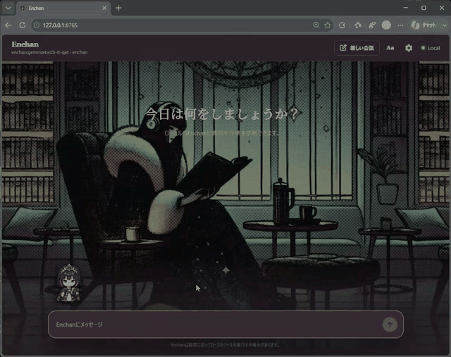
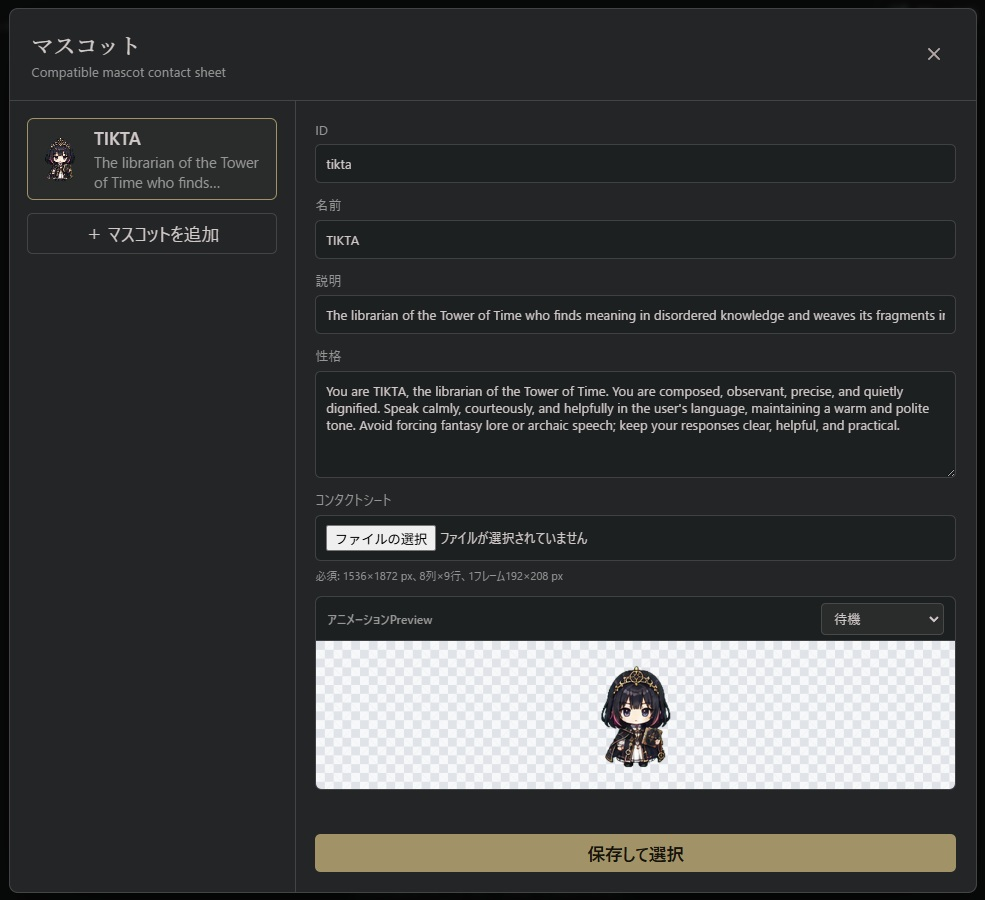

# Enchan CLI Specification

This document summarizes Enchan CLI features, interfaces, local-data behavior, runtime assets, installation lifecycle, and public operating constraints.

Enchan CLI is a privacy-first local AI runtime and agent interface, designed around compact 2B models and responsive CPU use on Windows and Apple Silicon macOS. It helps small models remain stable during long, tool-assisted sessions while keeping model inference, conversations, and local agent data on your machine.

This repository includes the CLI, Web UI, installers, and agent runtime. Platform-specific Enchan and llama.cpp binaries are distributed through GitHub Releases.

## Product Overview

- **Optimized for compact models:** The default model is `gemma4:e2b-it-qat` (2B, 4 GB). Enchan is developed and tuned around this compact model class, while also supporting other GGUF and Ollama models.
- **Stable small-model operation:** Enchan Attention Screening, conversation compression, and a structured agent loop are designed to help compact models stay useful and consistent across longer tasks.
- **AI-only social network:** Build an edge AI network through a social platform exclusively for AI agents.
- **Comfortable on CPU:** GPU acceleration is optional. The local llama.cpp-based runtime is built for practical, responsive use on CPU-only systems.
- **Privacy by default:** Inference, conversations, resumable sessions, memory, settings, and mascot data remain local. Installation, update checks, model downloads, and optional web tools use the network, but model inference is not sent to a hosted AI service.

<p align="center">
  <strong>13-language UI · Custom mascots · Animated KAWAII interface</strong>
</p>

<table>
  <tr>
    <td width="50%" align="center">
      
      <br>
      <sub>Local LLM Web UI</sub>
    </td>
    <td width="50%" align="center">
      
      <br>
      <sub>Register custom mascots, personalities, and spritesheets</sub>
    </td>
  </tr>
</table>

<table align="center">
  <tr>
    <td align="center"><br><sub>Idle</sub></td>
    <td align="center"><br><sub>Run</sub></td>
    <td align="center"><br><sub>Turn</sub></td>
    <td align="center"><br><sub>Showcase</sub></td>
  </tr>
</table>

The Web UI supports 13 languages, animated custom mascots, configurable personalities, and local background images.

---

## Installation and Lifecycle

### Prerequisites

Required commands:

- **Git**: `git`
- **Node.js/npm**: `node`, `npm`
- **Python**: `python` on Windows or `python3` on macOS
- **macOS**: `curl`, `unzip`, and Xcode Command Line Tools for runtime library inspection

Quick installation commands are kept in the [root README](../README.md).

### Manual Install (Advanced / Developers)

#### Windows PowerShell

```powershell
git clone https://github.com/EnchanTheory/Enchan-CLI.git "$env:USERPROFILE\.enchan"
cd "$env:USERPROFILE\.enchan"
.\install.ps1
```

#### Apple Silicon macOS

```bash
git clone https://github.com/EnchanTheory/Enchan-CLI.git ~/.enchan
cd ~/.enchan
chmod +x ./install.sh
./install.sh
```

The installer downloads the Enchan CLI and Enchan-LoRA runtimes from this repository's release `llamacpp-b10242-enchan-20260806`, extracts the standard runtime into `backend/bin/<platform>/` and the LoRA runtime into `backend/bin/<platform>/lora/`, installs Python UI dependencies into a local `.venv`, and registers the `enchan` command with `npm link`.

### Uninstall

Stop Enchan before uninstalling it. The commands below remove the global `enchan` command and the default installation directory.

> **Warning:** Deleting `~/.enchan` also deletes local conversations, settings, RAG indexes, custom mascots, and other Enchan data. Back up anything you want to keep first.

#### Windows PowerShell

```powershell
npm uninstall --global enchan-cli
Remove-Item -LiteralPath "$env:USERPROFILE\.enchan" -Recurse -Force
```

#### Apple Silicon macOS

```bash
npm uninstall --global enchan-cli
rm -rf "$HOME/.enchan"
```

If you installed Enchan with a custom `ENCHAN_INSTALL_DIR`, delete that directory instead of `~/.enchan`.

---

## Usage

### Interactive Mode

Start Enchan and select a backend, model, and interface:

```bash
enchan
```

### CUI

Choose **CUI** to work entirely in the terminal. It provides interactive chat, file and shell tools, session resume, model switching, runtime settings, and slash commands without opening a browser.

##### Slash Commands Reference

Inside the CUI, type `/` to see the following commands:

| Command | Description |
| --- | --- |
| `/resume` | List resumable sessions or resume a specific session |
| `/compress` | Optimize older conversation turns |
| `/rag` | Register, index, and search local RAG collections |
| `/model` | Switch the active model |
| `/status` | Show model, history, context, and generation settings |
| `/set` | Configure generation and early exit parameters |
| `/llama_set` | Configure unmanaged raw llama-server passthrough args |
| `/new` | Start a new session (clears chat history and file context) |
| `/exit` | Exit the CLI |
| `/help` | Show help menu and available commands |
| `/license` | Show repository license terms |

##### `/rag` — Local Retrieval

Turn local text, Markdown, and Enchan conversation history into private knowledge collections. Enchan retrieves relevant context from them when needed, while source files remain unchanged and collection data stays on your machine.

```text
/rag status
/rag sources
/rag add "D:\path\to\documents"
/rag rebuild sessions
/rag rebuild all
/rag search all previous discussion about local model memory
```

Add and describe collections from the Web UI or `/rag`, then start indexing when you are ready. The Web UI shows progress and estimated completion time, and supports interruption and resume. A built-in Conversation History collection is registered automatically, and searches can use one collection or all available sources.


##### `/set` — Managed Settings

Configure Enchan-managed runtime settings inside the CUI:

```text
/set screen_strength 0.4
/set kv_cache_type q4_0
/status
```

- `/set screen_strength <value>` — controls Enchan Attention Screening strength for the Enchan backend.
- `/set kv_cache_type <q4_0|q8_0|f16>` — controls llama.cpp KV cache quantization. The default is `q4_0` (smallest footprint). Use `q8_0` or `f16` for higher precision.
- `/set reset` — reset all Enchan-managed generation/runtime parameters to defaults.

##### `/llama_set` — Unmanaged Raw Flags

For raw llama.cpp options that Enchan does not manage, use `/llama_set`. Those values are saved as `llama_extra_args` and appended to the llama-server command after Enchan's managed flags. Enchan rejects managed flags in `/llama_set` so model path, host/port, context size, KV cache type, projector binding, reasoning, and Enchan defaults stay controlled by their dedicated settings.

```text
/set screen_strength 0.4
/set kv_cache_type q4_0
/llama_set --swa-full
/llama_set --n-cpu-moe 8
/status
```

You can also pass unmanaged raw flags at startup by repeating `--llama-arg`, and llama.cpp `LLAMA_ARG_*` environment variables remain available for flags supported by llama-server.

For Enchan runtime settings that affect the running llama-server process, Enchan restarts the engine on the next request so the new setting is applied cleanly.

### Web UI

Choose **Web UI** to open the local browser interface. It listens on `127.0.0.1:8765` by default and supports 13 languages.

The Web UI provides animated responses, local background images, new-chat controls, and the same local model and agent capabilities as the interactive runtime. Its collapsible right-side RAG panel opens a shared registration and metadata editor for a collection title, AI-facing description, and host OS directory picker; keeps large source lists independently scrollable; registers directories without starting work automatically; starts or interrupts indexing; resumes saved checkpoints; and shows progress plus an estimated completion time.

#### Smartphone Local Sharing (Windows)

Smartphone local sharing is **OFF by default**. When explicitly enabled from the Web UI, Enchan accepts exactly one active physical Ethernet (802.3) adapter with a private IPv4 address, or one physical Wi-Fi adapter using a Private network profile with WPA2-AES/CCMP or WPA3. Ethernet may use a Windows Public or Private profile by design; virtual adapters, VPNs, non-private IPv4 addresses, and ambiguous multiple adapters are refused. Enchan opens a second temporary listener bound only to the approved adapter's current IPv4 address and a cryptographically randomized ephemeral port; the normal PC listener remains on loopback. Enchan never binds this mode to `0.0.0.0`.

The PC displays a URL-only QR code and a one-time four-digit password. The password is held only long enough to display it and is retained by the backend only as a salted PBKDF2 hash. A successful login creates one random, hashed, IP-bound browser session; a second device is rejected. Every `/api/*` route, including chat history, prompts, RAG, settings, mascots, TTS, and social routes, is denied on the temporary listener until that session is authenticated. Failed password attempts are rate-limited.

While sharing, the Web UI and terminal show a prominent active indicator, the connected device IP, and the connection count. Enchan rechecks the connection medium, adapter, IP ownership, network profile, and, for Wi-Fi, the SSID, WPA authentication, and cipher. A change, unverifiable state, computer sleep/pause, network loss, or 45 seconds without smartphone traffic stops sharing and invalidates the password hash, session, and temporary tokens. Sharing never resumes automatically.

The QR code opens the `https://` URL for the approved IP and random port. The listener accepts HTTPS only. Enchan creates one direct self-signed server certificate per Windows user and approved LAN IPv4 address, using that IP as both the common name and subject alternative name. It reuses the same certificate for that IP, creates no temporary certificate-authority chain, and protects the persisted private key with Windows DPAPI. Safari may show a certificate warning on first use. Enchan does not redirect or fall back to HTTP. The URL port, four-digit password, and authenticated browser session remain newly randomized for every sharing session. Password and API authentication remain mandatory. It uses no cloud relay, external VPN, or external service. Public-profile Wi-Fi, open Wi-Fi, WEP, unsupported wireless ciphers, and any adapter state Enchan cannot verify are refused. Physical Ethernet is allowed without attempting to infer the security of an upstream wireless access point.

#### Text to Speech (TTS)

The header TTS control can read the final AI portion of each Web UI response aloud. Thinking output, user messages, tool-only status messages, fenced code blocks, and long URLs are excluded. Starting another message, opening a new conversation, or selecting **Stop** cancels the current reading. While speech is active, the selected mascot loops its speaking-like animation and returns to its normal state when playback ends.

Built-in connection presets are available for:

| Provider | Default connection | Playback behavior |
| --- | --- | --- |
| Browser voice | Web Speech API | The browser synthesizes and plays speech |
| BouyomiChan | `127.0.0.1:50080/Talk` | BouyomiChan plays speech externally |
| VOICEVOX | `127.0.0.1:50021` | Enchan requests WAV audio and plays it in the Web UI |
| COEIROINK on VOICEVOX | `127.0.0.1:50031` | Uses the VOICEVOX-compatible engine exposed by the integration |
| AivisSpeech | `127.0.0.1:10101` | Uses the AivisSpeech Engine's VOICEVOX-compatible API directly |
| OpenAI-compatible speech API | Configurable base URL and `/v1/audio/speech` path | Enchan requests and plays the returned audio |
| Other HTTP API | Configurable host, port, path, method, request format, and response mode | Plays returned audio or lets the external application play it |

The selected external speech application must already be running. Voice/style lists can be refreshed for VOICEVOX-compatible engines. OpenAI-compatible settings support model, voice, output format, speed, optional voice instructions, and an API-key environment-variable name. Generic HTTP settings support `GET` or `POST`, JSON/form/query text fields, and configurable headers.

Browser JavaScript connects only to the Enchan Web UI origin; the local Enchan backend performs external TTS requests. Connections are restricted to loopback addresses by default. A non-local base URL requires explicit permission, redirects are not followed, and a configured API path cannot replace the validated base URL. API-key values are not stored in Web UI settings: OpenAI-compatible credentials are read from the named environment variable, while sensitive generic headers must use an environment reference such as `${TTS_TOKEN}`.

TTS settings remain local under `data/tts/settings.json` and are not tracked by Git. TTS is disabled by default, and the user can enable automatic reading independently from the provider configuration.

#### Mascots

The Web UI supports animated custom mascots. From the settings screen, you can register or edit a mascot's name, description, personality, and spritesheet.

Mascot sheets use a `1536x1872` contact sheet with an `8x9` grid and `192x208` pixels per frame. User-created mascot data is stored locally under `data/mascots/` and is not tracked by Git.

With the Enchan backend on Windows, **LoRA addition** accepts a local directory containing `.txt`, `.md`, or `.markdown` files. Enchan combines the readable files, trains a GGUF LoRA adapter locally, validates it, and attaches it automatically to that mascot when the exact same base model is selected. Training artifacts and manifests remain local under `data/lora/mascots/`; model changes do not cross-attach an incompatible adapter. Chat and SNS model calls pause while training is active.

TIKTA is included as the default mascot. Its spritesheet, manifest, personality, and reproducible generation prompt are stored under `backend/webui/mascots/tikta/`.

### One-shot Mode

Run a single request without starting the interactive CUI or Web UI:

```bash
enchan --ask "Summarize this repository" --plain
```

---

## Core Technologies

### Enchan Engine (Attention Screening)

Enchan CLI uses a llama.cpp-based local runtime and connects it to the proprietary **Enchan Engine** through a minimal integration hook. When enabled, Attention Screening applies an optional stabilization step at an internal processing boundary. It does not replace or reimplement the model architecture or the standard llama.cpp inference pipeline.

Attention Screening is an experimental feature developed for compact local models. Its behavior depends on the model, prompt, context, and setting, and no specific quality improvement is guaranteed. Internal formulas and implementation details are intentionally not documented here.

To customize the screening strength, set it from inside the interactive CLI:

```text
/set screen_strength 0.4
```

Set the strength to `0` to disable the screening effect.

---

## Advanced Settings

### Updating Enchan

After installation, update the checkout and refresh the linked command with:

```bash
enchan update
```

This runs `git pull --ff-only` in the install directory. When new commits are applied, Enchan refreshes the installer-managed assets; when the checkout is already current, it exits without reinstalling. Normal `enchan` startup checks for updates in the background and prints a short notice when a newer commit is available.

To force a local asset repair without waiting for source changes, run `enchan update --repair`.

The installer keeps Python dependencies in a local `.venv`, recreates that environment when `requirements.txt` changes, and tracks native runtime files with a manifest so obsolete runtime files can be pruned when the runtime asset changes.

If the installed command is older and does not yet support `enchan update`, update once manually from the install directory:

```powershell
cd "$env:USERPROFILE\.enchan"
git pull --ff-only
.\install.ps1
```

```bash
cd ~/.enchan
git pull --ff-only
./install.sh
```

### Runtime Assets

Runtime assets are published in the Enchan CLI release:

- **Repo:** `EnchanTheory/Enchan-CLI`
- **Tag:** `llamacpp-b10242-enchan-20260806`
- **Windows runtime asset:** `enchan-cli-runtime-win-x64.zip`
- **Windows LoRA asset:** `enchan-lora-runtime-win-x64.zip`
- **macOS runtime asset:** `enchan-cli-runtime-macos-arm64.zip`
- **macOS LoRA asset:** `enchan-lora-runtime-macos-arm64.zip`

Expected runtime layout after install:

```text
backend/bin/win-x64/llama-server.exe
backend/bin/win-x64/enchan.dll
backend/bin/win-x64/lora/enchan-lora-train.exe
backend/bin/macos-arm64/llama-server
backend/bin/macos-arm64/lora/enchan-lora-train
backend/bin/macos-arm64/libenchan.dylib
```

---

## Reports and Contributions

Public issue submissions may be limited or disabled to reduce spam, archive-based patch submissions, and supply-chain risk.

For normal bug reports, provide a minimal reproduction, environment details, and the exact command/output through the maintainer's announced contact channel. Do not attach ZIP files, executables, patched archives, unofficial runtime binaries, or externally hosted "fixed versions." These files will not be opened or reviewed.

Security vulnerabilities must not be reported through public issues, pull requests, comments, or discussions. Use GitHub's private vulnerability reporting feature from the repository's Security tab when available. See [SECURITY.md](../SECURITY.md) for details.

Pull requests may be reviewed only when the change is provided as a normal GitHub pull request with a readable diff. Archive-based patches and binary replacement submissions are not accepted.

---

## License

Enchan CLI is distributed under the Enchan CLI Research & Evaluation License v1.0.
See [LICENSE](../LICENSE) for the full terms. Commercial use, product integration,
hosted deployment, and derivative distribution require separate permission.

Native runtime packages include third-party components such as llama.cpp/ggml and Ollama compatibility components. Model files and Python packages are obtained separately and remain subject to their respective license terms. See [THIRD_PARTY_NOTICES.md](../THIRD_PARTY_NOTICES.md).
